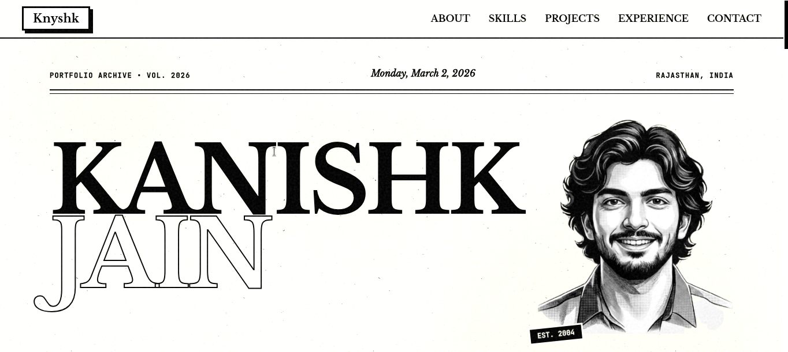

# Modern Developer Portfolio

A sleek, premium, and highly interactive developer portfolio built with a cutting-edge tech stack. This project showcases a professional journey, technical skills, and featured projects with a focus on high-performance animations and visual excellence.

 *Replace with a real screenshot of your portfolio*

## 🚀 Features

- **Dynamic Hero Section**: Engaging introduction with smooth entrance animations.
- **Interactive Projects Grid**: Showcases key work with rich hover effects and detailed project information.
- **Advanced Animations**: Powered by Framer Motion and Motion for high-quality transitions and micro-interactions.
- **Smooth Scrolling**: Integrated with Lenis for a premium, non-native scrolling experience.
- **Comprehensive Sections**: 
    - About, Experience, and Education
    - Skills & Competencies
    - Competitive Programming & Achievements
    - Certifications
    - Real-time Quick Stats
- **Functional Contact Form**: Integrated with a Node.js backend to handle inquiries via Email (Nodemailer).
- **AI Integration**: Leverages Google Gemini AI for intelligent features (if utilized in the app logic).
- **Responsive Design**: Fully optimized for desktop and mobile devices.

## 🛠️ Tech Stack

### Frontend
- **React 19**: Modern UI development.
- **Vite 6**: Ultra-fast build tool and development server.
- **Tailwind CSS 4**: Utility-first CSS framework for rapid UI development.
- **Framer Motion & Motion**: For complex and fluid animations.
- **Lenis**: Smooth scroll orchestration.
- **Lucide React**: Clean and consistent iconography.

### Backend
- **Node.js & Express**: Light-weight server for handling API requests and emails.
- **Better SQLite3**: High-performance local database for data persistence.
- **Nodemailer**: Email service integration.
- **Google Generative AI**: AI-powered features.

## 📁 Project Structure

```text
├── server/             # Express server logic (API, Emails, Database)
├── src/
│   ├── components/     # Reusable UI components
│   ├── data/           # Static data and configuration
│   ├── lib/            # Utility functions and library wrappers
│   ├── sections/       # Main portfolio sections (Hero, Projects, etc.)
│   ├── App.tsx         # Main application entry point
│   └── index.css       # Global styles and Tailwind configuration
├── index.html          # HTML template
└── package.json        # Project dependencies and scripts
```

## 🏁 Getting Started

### Prerequisites
- Node.js (Latest LTS recommended)
- npm or yarn

### Installation

1. **Clone the repository:**
   ```bash
   git clone https://github.com/knyshk/portfolio
   cd Portfolio
   ```

2. **Install dependencies:**
   ```bash
   npm install
   ```

3. **Configure Environment Variables:**
   Create a `.env` file in the root directory based on `.env.example`:
   ```bash
   cp .env.example .env
   ```
   *Fill in your credentials for Nodemailer and Google GenAI.*

### Running the Application

To run both the frontend and backend in development mode:

```bash
npm run dev
```

The application will be available at [http://localhost:3000](http://localhost:3000).

---

## 📄 License

This project is open-source and available under the MIT License.

## 🤝 Contact

Created by Kanishk Jain - feel free to reach out via the contact form on the site!
